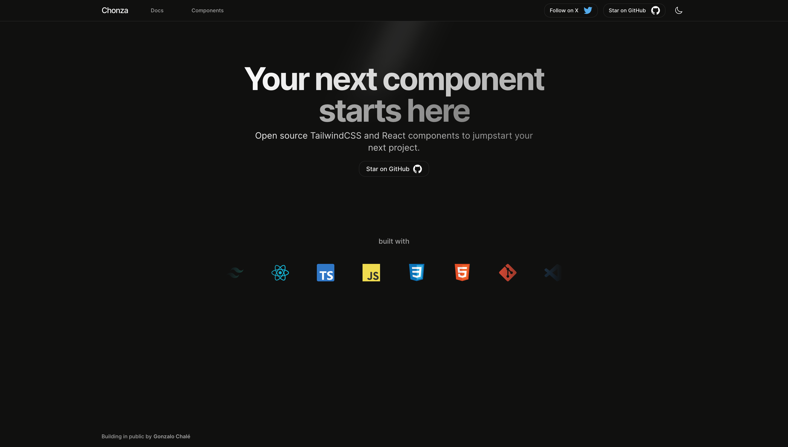

# AstroUI - AstroJS components library

## Introduction

AstroUI is a collection of components and styles that can be used to build AstroJS applications.

## Features

- **Simple**: AstroUI is designed to be simple and easy to use. It is built on top of TailwindCSS, which makes it easy to integrate into your projects.

- **Customizable**: AstroUI is highly customizable. You can easily change the colors, fonts, and other styles to match your brand.

- **Responsive**: AstroUI is designed to be responsive. It works on all devices, from mobile to desktop.

- **Open Source**: AstroUI is open source. You can use it for free in your personal and commercial projects and contribute to its development.

## Installation

You only need to install the dependencies and import the components that you want to use in your project.

Dependencies:

- **TailwindCSS**: AstroUI uses TailwindCSS for styling, so you need to have TailwindCSS installed in your project.

## Credits

AstroUI is inspired by other libraries like **ShadCN** and **MagicUI** so I want to give them credit for their work and inspiration, also I want to thank the **TailwindCSS** team for their amazing work.
